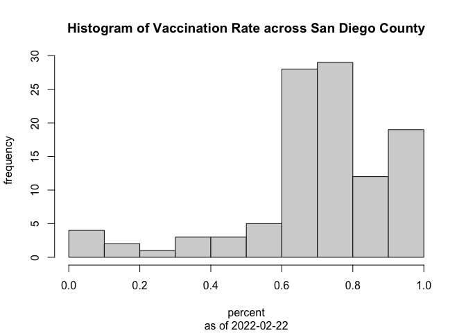
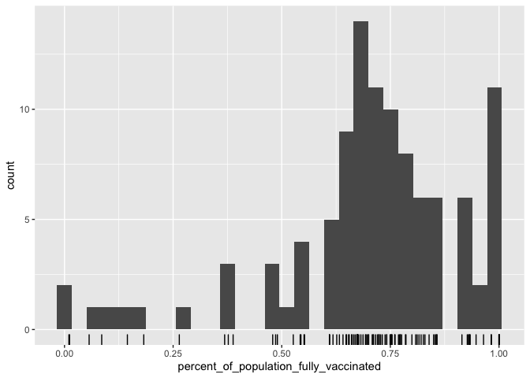
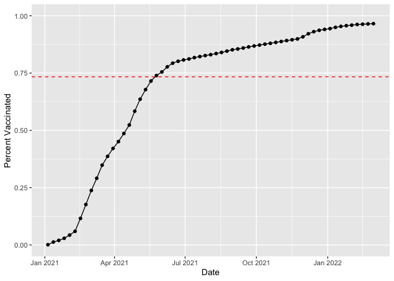
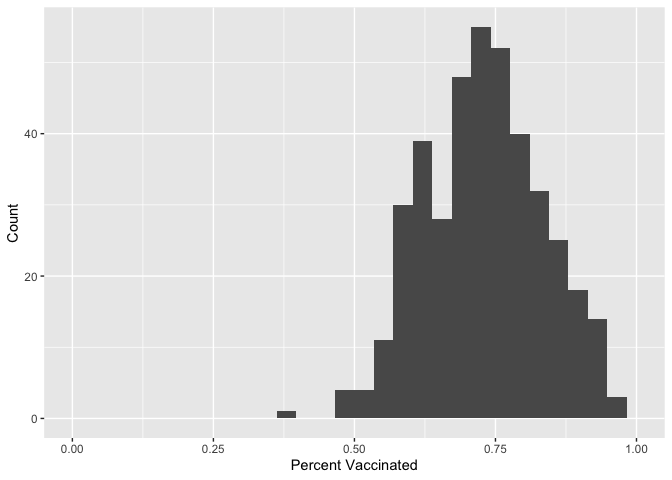
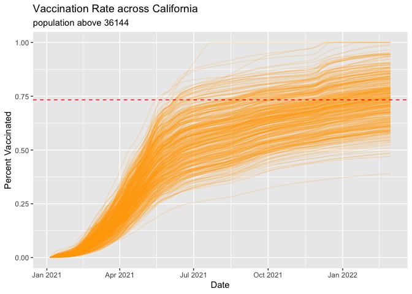

class14
================
Nattiwong
3/4/2022

``` r
vax <- read.csv("covid19vaccinesbyzipcode_test.csv")
```

``` r
library(dplyr)
#install.packages("skimr")
library(skimr)
#install.packages("lubridate")
library(lubridate)
#install.packages("zipcodeR")
library(zipcodeR)
library(tidyverse)
```

``` r
skimr::skim(vax)
```

|                                                  |        |
|:-------------------------------------------------|:-------|
| Name                                             | vax    |
| Number of rows                                   | 107604 |
| Number of columns                                | 15     |
| \_\_\_\_\_\_\_\_\_\_\_\_\_\_\_\_\_\_\_\_\_\_\_   |        |
| Column type frequency:                           |        |
| character                                        | 5      |
| numeric                                          | 10     |
| \_\_\_\_\_\_\_\_\_\_\_\_\_\_\_\_\_\_\_\_\_\_\_\_ |        |
| Group variables                                  | None   |

Data summary

**Variable type: character**

| skim\_variable              | n\_missing | complete\_rate | min | max | empty | n\_unique | whitespace |
|:----------------------------|-----------:|---------------:|----:|----:|------:|----------:|-----------:|
| as\_of\_date                |          0 |              1 |  10 |  10 |     0 |        61 |          0 |
| local\_health\_jurisdiction |          0 |              1 |   0 |  15 |   305 |        62 |          0 |
| county                      |          0 |              1 |   0 |  15 |   305 |        59 |          0 |
| vem\_source                 |          0 |              1 |  15 |  26 |     0 |         3 |          0 |
| redacted                    |          0 |              1 |   2 |  69 |     0 |         2 |          0 |

**Variable type: numeric**

| skim\_variable                                 | n\_missing | complete\_rate |     mean |       sd |    p0 |      p25 |      p50 |      p75 |     p100 | hist  |
|:-----------------------------------------------|-----------:|---------------:|---------:|---------:|------:|---------:|---------:|---------:|---------:|:------|
| zip\_code\_tabulation\_area                    |          0 |           1.00 | 93665.11 |  1817.39 | 90001 | 92257.75 | 93658.50 | 95380.50 |  97635.0 | ▃▅▅▇▁ |
| vaccine\_equity\_metric\_quartile              |       5307 |           0.95 |     2.44 |     1.11 |     1 |     1.00 |     2.00 |     3.00 |      4.0 | ▇▇▁▇▇ |
| age12\_plus\_population                        |          0 |           1.00 | 18895.04 | 18993.91 |     0 |  1346.95 | 13685.10 | 31756.12 |  88556.7 | ▇▃▂▁▁ |
| age5\_plus\_population                         |          0 |           1.00 | 20875.24 | 21106.02 |     0 |  1460.50 | 15364.00 | 34877.00 | 101902.0 | ▇▃▂▁▁ |
| persons\_fully\_vaccinated                     |      18338 |           0.83 | 12155.61 | 13063.88 |    11 |  1066.25 |  7374.50 | 20005.00 |  77744.0 | ▇▃▁▁▁ |
| persons\_partially\_vaccinated                 |      18338 |           0.83 |   831.74 |  1348.68 |    11 |    76.00 |   372.00 |  1076.00 |  34219.0 | ▇▁▁▁▁ |
| percent\_of\_population\_fully\_vaccinated     |      18338 |           0.83 |     0.51 |     0.26 |     0 |     0.33 |     0.54 |     0.70 |      1.0 | ▅▅▇▇▃ |
| percent\_of\_population\_partially\_vaccinated |      18338 |           0.83 |     0.05 |     0.09 |     0 |     0.01 |     0.03 |     0.05 |      1.0 | ▇▁▁▁▁ |
| percent\_of\_population\_with\_1\_plus\_dose   |      18338 |           0.83 |     0.54 |     0.28 |     0 |     0.36 |     0.58 |     0.75 |      1.0 | ▅▃▆▇▅ |
| booster\_recip\_count                          |      64317 |           0.40 |  4100.55 |  5900.21 |    11 |   176.00 |  1136.00 |  6154.50 |  50602.0 | ▇▁▁▁▁ |

Q1. What column details the total number of people fully vaccinated?

``` r
head(vax$persons_fully_vaccinated)
```

    ## [1] NA 61 NA NA NA NA

Q2. What column details the Zip code tabulation area?

``` r
head(vax$zip_code_tabulation_area)
```

    ## [1] 92549 92130 92397 94563 94519 91042

Q3. What is the earliest date in this dataset?

``` r
vax[1,1]
```

    ## [1] "2021-01-05"

Q4. What is the latest date in this dataset?

``` r
vax[nrow(vax),1]
```

    ## [1] "2022-03-01"

Q5. How many numeric columns are in this dataset? 10 columns

Q6. Note that there are “missing values” in the dataset. How many NA
values there in the persons\_fully\_vaccinated column?

``` r
sum(is.na(vax$persons_fully_vaccinated))
```

    ## [1] 18338

Q7. What percent of persons\_fully\_vaccinated values are missing (to 2
significant figures)?

``` r
round((sum(is.na(vax$persons_fully_vaccinated))/length(vax$persons_fully_vaccinated))*100,2)
```

    ## [1] 17.04

Q8. \[Optional\]: Why might this data be missing?

``` r
vax$as_of_date <- ymd(vax$as_of_date)
today() - vax$as_of_date[1]
```

    ## Time difference of 430 days

``` r
vax$as_of_date[nrow(vax)] - vax$as_of_date[1]
```

    ## Time difference of 420 days

Q9. How many days have passed since the last update of the dataset?

``` r
today() - vax$as_of_date[nrow(vax)]
```

    ## Time difference of 10 days

Q10. How many unique dates are in the dataset (i.e. how many different
dates are detailed)?

``` r
length(unique(ymd(vax$as_of_date)))
```

    ## [1] 61

Overwrite the as\_of\_date column by the output of ymd() function

``` r
vax$as_of_date <- ymd(vax$as_of_date)
```

``` r
vax$as_of_date[nrow(vax)] - vax$as_of_date[1]
```

    ## Time difference of 420 days

``` r
geocode_zip('92037')
```

    ## # A tibble: 1 x 3
    ##   zipcode   lat   lng
    ##   <chr>   <dbl> <dbl>
    ## 1 92037    32.8 -117.

``` r
zip_distance('92037','92109')
```

    ##   zipcode_a zipcode_b distance
    ## 1     92037     92109     2.33

``` r
reverse_zipcode(c('92037', "92109") )
```

    ## # A tibble: 2 x 24
    ##   zipcode zipcode_type major_city post_office_city common_city_list county state
    ##   <chr>   <chr>        <chr>      <chr>                      <blob> <chr>  <chr>
    ## 1 92037   Standard     La Jolla   La Jolla, CA           <raw 20 B> San D… CA   
    ## 2 92109   Standard     San Diego  San Diego, CA          <raw 21 B> San D… CA   
    ## # … with 17 more variables: lat <dbl>, lng <dbl>, timezone <chr>,
    ## #   radius_in_miles <dbl>, area_code_list <blob>, population <int>,
    ## #   population_density <dbl>, land_area_in_sqmi <dbl>,
    ## #   water_area_in_sqmi <dbl>, housing_units <int>,
    ## #   occupied_housing_units <int>, median_home_value <int>,
    ## #   median_household_income <int>, bounds_west <dbl>, bounds_east <dbl>,
    ## #   bounds_north <dbl>, bounds_south <dbl>

``` r
zipdata <- reverse_zipcode( vax$zip_code_tabulation_area )
```

\#focus on the San Diego area

``` r
head(vax[vax$county == "San Diego",])
```

    ##    as_of_date zip_code_tabulation_area local_health_jurisdiction    county
    ## 2  2021-01-05                    92130                 San Diego San Diego
    ## 13 2021-01-05                    91945                 San Diego San Diego
    ## 33 2021-01-05                    91917                 San Diego San Diego
    ## 54 2021-01-05                    92103                 San Diego San Diego
    ## 57 2021-01-05                    92075                 San Diego San Diego
    ## 58 2021-01-05                    92084                 San Diego San Diego
    ##    vaccine_equity_metric_quartile                 vem_source
    ## 2                               4 Healthy Places Index Score
    ## 13                              2 Healthy Places Index Score
    ## 33                              1    CDPH-Derived ZCTA Score
    ## 54                              4 Healthy Places Index Score
    ## 57                              4 Healthy Places Index Score
    ## 58                              2 Healthy Places Index Score
    ##    age12_plus_population age5_plus_population persons_fully_vaccinated
    ## 2                46300.3                53102                       61
    ## 13               22820.5                25486                       NA
    ## 33                 826.1                  939                       NA
    ## 54               32146.4                33213                       45
    ## 57               11136.3                12177                       NA
    ## 58               42677.7                47784                       12
    ##    persons_partially_vaccinated percent_of_population_fully_vaccinated
    ## 2                            27                               0.001149
    ## 13                           NA                                     NA
    ## 33                           NA                                     NA
    ## 54                           30                               0.001355
    ## 57                           NA                                     NA
    ## 58                           17                               0.000251
    ##    percent_of_population_partially_vaccinated
    ## 2                                    0.000508
    ## 13                                         NA
    ## 33                                         NA
    ## 54                                   0.000903
    ## 57                                         NA
    ## 58                                   0.000356
    ##    percent_of_population_with_1_plus_dose booster_recip_count
    ## 2                                0.001657                  NA
    ## 13                                     NA                  NA
    ## 33                                     NA                  NA
    ## 54                               0.002258                  NA
    ## 57                                     NA                  NA
    ## 58                               0.000607                  NA
    ##                                                                 redacted
    ## 2  Information redacted in accordance with CA state privacy requirements
    ## 13 Information redacted in accordance with CA state privacy requirements
    ## 33 Information redacted in accordance with CA state privacy requirements
    ## 54 Information redacted in accordance with CA state privacy requirements
    ## 57 Information redacted in accordance with CA state privacy requirements
    ## 58 Information redacted in accordance with CA state privacy requirements

Select some specific row by filter function in dplyr package

``` r
sd <- filter(vax, county == "San Diego")
#vax %>% filter(country=="San Diego")
```

``` r
head(sd)
```

    ##   as_of_date zip_code_tabulation_area local_health_jurisdiction    county
    ## 1 2021-01-05                    92130                 San Diego San Diego
    ## 2 2021-01-05                    91945                 San Diego San Diego
    ## 3 2021-01-05                    91917                 San Diego San Diego
    ## 4 2021-01-05                    92103                 San Diego San Diego
    ## 5 2021-01-05                    92075                 San Diego San Diego
    ## 6 2021-01-05                    92084                 San Diego San Diego
    ##   vaccine_equity_metric_quartile                 vem_source
    ## 1                              4 Healthy Places Index Score
    ## 2                              2 Healthy Places Index Score
    ## 3                              1    CDPH-Derived ZCTA Score
    ## 4                              4 Healthy Places Index Score
    ## 5                              4 Healthy Places Index Score
    ## 6                              2 Healthy Places Index Score
    ##   age12_plus_population age5_plus_population persons_fully_vaccinated
    ## 1               46300.3                53102                       61
    ## 2               22820.5                25486                       NA
    ## 3                 826.1                  939                       NA
    ## 4               32146.4                33213                       45
    ## 5               11136.3                12177                       NA
    ## 6               42677.7                47784                       12
    ##   persons_partially_vaccinated percent_of_population_fully_vaccinated
    ## 1                           27                               0.001149
    ## 2                           NA                                     NA
    ## 3                           NA                                     NA
    ## 4                           30                               0.001355
    ## 5                           NA                                     NA
    ## 6                           17                               0.000251
    ##   percent_of_population_partially_vaccinated
    ## 1                                   0.000508
    ## 2                                         NA
    ## 3                                         NA
    ## 4                                   0.000903
    ## 5                                         NA
    ## 6                                   0.000356
    ##   percent_of_population_with_1_plus_dose booster_recip_count
    ## 1                               0.001657                  NA
    ## 2                                     NA                  NA
    ## 3                                     NA                  NA
    ## 4                               0.002258                  NA
    ## 5                                     NA                  NA
    ## 6                               0.000607                  NA
    ##                                                                redacted
    ## 1 Information redacted in accordance with CA state privacy requirements
    ## 2 Information redacted in accordance with CA state privacy requirements
    ## 3 Information redacted in accordance with CA state privacy requirements
    ## 4 Information redacted in accordance with CA state privacy requirements
    ## 5 Information redacted in accordance with CA state privacy requirements
    ## 6 Information redacted in accordance with CA state privacy requirements

``` r
nrow(sd)
```

    ## [1] 6527

Q11. How many zip codes are there in San Diego country?

``` r
length(unique(sd$zip_code_tabulation_area))
```

    ## [1] 107

``` r
length(table(sd$zip_code_tabulation_area))
```

    ## [1] 107

``` r
vax %>%
    filter(county == "San Diego") %>%
    select(zip_code_tabulation_area) %>%
    unique %>%
    nrow()
```

    ## [1] 107

Q12. What San Diego County Zip code area has the largest 12 + Population
in this dataset?

``` r
sd %>% 
    filter(age12_plus_population==max(sd$age12_plus_population)) %>%
    select(zip_code_tabulation_area) %>%
    unique()
```

    ##   zip_code_tabulation_area
    ## 1                    92154

``` r
inds <- order(sd$age12_plus_population, decreasing = TRUE)
sd[inds[1],]
```

    ##    as_of_date zip_code_tabulation_area local_health_jurisdiction    county
    ## 91 2021-01-05                    92154                 San Diego San Diego
    ##    vaccine_equity_metric_quartile                 vem_source
    ## 91                              2 Healthy Places Index Score
    ##    age12_plus_population age5_plus_population persons_fully_vaccinated
    ## 91               76365.2                82971                       18
    ##    persons_partially_vaccinated percent_of_population_fully_vaccinated
    ## 91                           22                               0.000217
    ##    percent_of_population_partially_vaccinated
    ## 91                                   0.000265
    ##    percent_of_population_with_1_plus_dose booster_recip_count
    ## 91                               0.000482                  NA
    ##                                                                 redacted
    ## 91 Information redacted in accordance with CA state privacy requirements

``` r
ind <- which.max(sd$age12_plus_population)
sd$zip_code_tabulation_area[ind]
```

    ## [1] 92154

``` r
arrange(sd, -age12_plus_population)[1,]
```

    ##   as_of_date zip_code_tabulation_area local_health_jurisdiction    county
    ## 1 2021-01-05                    92154                 San Diego San Diego
    ##   vaccine_equity_metric_quartile                 vem_source
    ## 1                              2 Healthy Places Index Score
    ##   age12_plus_population age5_plus_population persons_fully_vaccinated
    ## 1               76365.2                82971                       18
    ##   persons_partially_vaccinated percent_of_population_fully_vaccinated
    ## 1                           22                               0.000217
    ##   percent_of_population_partially_vaccinated
    ## 1                                   0.000265
    ##   percent_of_population_with_1_plus_dose booster_recip_count
    ## 1                               0.000482                  NA
    ##                                                                redacted
    ## 1 Information redacted in accordance with CA state privacy requirements

Q13. What is the overall average “Percent of Population Fully
Vaccinated” value for all San Diego “County” as of “2022-02-22”?

``` r
sd.now <- sd %>% 
    filter(as_of_date==ymd("2022-02-22"))
mean(sd.now$percent_of_population_fully_vaccinated, na.rm = TRUE)
```

    ## [1] 0.7041551

``` r
sd %>% 
    filter(as_of_date==ymd("2022-02-22")) %>%
    select(percent_of_population_fully_vaccinated) %>%
    colMeans(na.rm=T) #
```

    ## percent_of_population_fully_vaccinated 
    ##                              0.7041551

Q14. Using either ggplot or base R graphics make a summary figure that
shows the distribution of Percent of Population Fully Vaccinated values
as of “2022-02-22”?

``` r
hist(sd.now$percent_of_population_fully_vaccinated, 
     xlab="percent",
     ylab="frequency",
     main="Histogram of Vaccination Rate across San Diego County",
     sub="as of 2022-02-22")
```

<!-- -->

``` r
ggplot(sd.now) +
    aes(percent_of_population_fully_vaccinated) +
    geom_histogram() +
    geom_rug()
```

    ## `stat_bin()` using `bins = 30`. Pick better value with `binwidth`.

    ## Warning: Removed 1 rows containing non-finite values (stat_bin).

<!-- -->

``` r
ucsd <- filter(sd, sd$zip_code_tabulation_area=="92037")
ucsd[1,]$age5_plus_population
```

    ## [1] 36144

Q15. Using ggplot make a graph of the vaccination rate time course for
the 92037 ZIP code area:

``` r
ucsd.plot <- ggplot(ucsd) +
  aes(x=as_of_date,
      y=percent_of_population_fully_vaccinated) +
  geom_point() +
  geom_line(group=1) +
  ylim(c(0,1)) +
  labs(x="Date", y="Percent Vaccinated")
```

Q16. Calculate the mean “Percent of Population Fully Vaccinated” for ZIP
code areas with a population as large as 92037 (La Jolla) as\_of\_date
“2022-02-22”. Add this as a straight horizontal line to your plot from
above with the geom\_hline() function?

``` r
lj <- filter(sd.now, sd.now$zip_code_tabulation_area=="92037")
lj$age5_plus_population
```

    ## [1] 36144

``` r
vax.36 <- filter(vax, age5_plus_population > lj$age5_plus_population &
                as_of_date == "2022-02-22")
mean(vax.36$percent_of_population_fully_vaccinated)
```

    ## [1] 0.733385

``` r
ucsd.plot +
    geom_hline(yintercept = mean(vax.36$percent_of_population_fully_vaccinated),
               color="red",
               linetype=2)
```

<!-- -->

Q17. What is the 6 number summary (Min, 1st Qu., Median, Mean, 3rd Qu.,
and Max) of the “Percent of Population Fully Vaccinated” values for ZIP
code areas with a population as large as 92037 (La Jolla) as\_of\_date
“2022-02-22”?

``` r
summary(vax.36$percent_of_population_fully_vaccinated)
```

    ##    Min. 1st Qu.  Median    Mean 3rd Qu.    Max. 
    ##  0.3881  0.6539  0.7333  0.7334  0.8027  1.0000

Q18. Using ggplot generate a histogram of this data.

``` r
ggplot(vax.36) +
  aes(percent_of_population_fully_vaccinated) +
  geom_histogram() +
  labs(x="Percent Vaccinated", y="Count") +
    xlim(0,1)
```

    ## `stat_bin()` using `bins = 30`. Pick better value with `binwidth`.

    ## Warning: Removed 2 rows containing missing values (geom_bar).

<!-- --> Q19. Is the
92109 and 92040 ZIP code areas above or below the average value you
calculated for all these above?

``` r
vax %>% filter(as_of_date == "2022-02-22") %>%  
  filter(zip_code_tabulation_area=="92040") %>%
  select(percent_of_population_fully_vaccinated)
```

    ##   percent_of_population_fully_vaccinated
    ## 1                               0.551304

Q20. Finally make a time course plot of vaccination progress for all
areas in the full dataset with a age5\_plus\_population &gt; 36144.

``` r
vax.36.all <- filter(vax, age5_plus_population > 36144)


ggplot(vax.36.all) +
  aes(as_of_date,
      percent_of_population_fully_vaccinated, 
      group=zip_code_tabulation_area) +
  geom_line(alpha=0.2, color="orange") +
  labs(x="Date", y="Percent Vaccinated",
       title="Vaccination Rate across California",
       subtitle="population above 36144") +
  geom_hline(yintercept = mean(vax.36$percent_of_population_fully_vaccinated),
             linetype=2,
             color="red")
```

    ## Warning: Removed 311 row(s) containing missing values (geom_path).

<!-- -->
