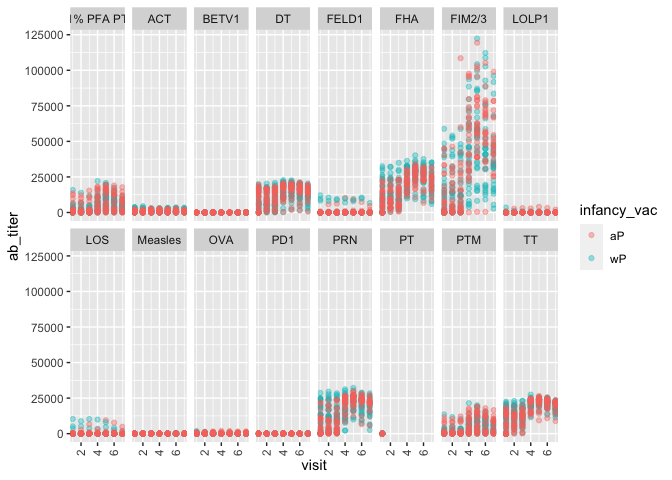

class15
================
Nattiwong
3/9/2022

``` r
#install.packages("datapasta")
library(datapasta)
library(ggplot2)
library(jsonlite)
```

    ## Warning: package 'jsonlite' was built under R version 4.1.2

``` r
library(dplyr)
```

    ## 
    ## Attaching package: 'dplyr'

    ## The following objects are masked from 'package:stats':
    ## 
    ##     filter, lag

    ## The following objects are masked from 'package:base':
    ## 
    ##     intersect, setdiff, setequal, union

Q1. With the help of the R “addin” package datapasta assign the CDC
pertussis case number data to a data frame called cdc and use ggplot to
make a plot of cases numbers over time.

Pull the data from clipboard and explore the CDC cases by year data.
<https://www.cdc.gov/pertussis/surv-reporting/cases-by-year.html>

``` r
cdc <- data.frame(
                                 Year = c(1922L,1923L,1924L,1925L,
                                          1926L,1927L,1928L,1929L,1930L,1931L,
                                          1932L,1933L,1934L,1935L,1936L,
                                          1937L,1938L,1939L,1940L,1941L,1942L,
                                          1943L,1944L,1945L,1946L,1947L,
                                          1948L,1949L,1950L,1951L,1952L,
                                          1953L,1954L,1955L,1956L,1957L,1958L,
                                          1959L,1960L,1961L,1962L,1963L,
                                          1964L,1965L,1966L,1967L,1968L,1969L,
                                          1970L,1971L,1972L,1973L,1974L,
                                          1975L,1976L,1977L,1978L,1979L,1980L,
                                          1981L,1982L,1983L,1984L,1985L,
                                          1986L,1987L,1988L,1989L,1990L,
                                          1991L,1992L,1993L,1994L,1995L,1996L,
                                          1997L,1998L,1999L,2000L,2001L,
                                          2002L,2003L,2004L,2005L,2006L,2007L,
                                          2008L,2009L,2010L,2011L,2012L,
                                          2013L,2014L,2015L,2016L,2017L,2018L,
                                          2019L),
         No..Reported.Pertussis.Cases = c(107473,164191,165418,152003,
                                          202210,181411,161799,197371,
                                          166914,172559,215343,179135,265269,
                                          180518,147237,214652,227319,103188,
                                          183866,222202,191383,191890,109873,
                                          133792,109860,156517,74715,69479,
                                          120718,68687,45030,37129,60886,
                                          62786,31732,28295,32148,40005,
                                          14809,11468,17749,17135,13005,6799,
                                          7717,9718,4810,3285,4249,3036,
                                          3287,1759,2402,1738,1010,2177,2063,
                                          1623,1730,1248,1895,2463,2276,
                                          3589,4195,2823,3450,4157,4570,
                                          2719,4083,6586,4617,5137,7796,6564,
                                          7405,7298,7867,7580,9771,11647,
                                          25827,25616,15632,10454,13278,
                                          16858,27550,18719,48277,28639,32971,
                                          20762,17972,18975,15609,18617)
       )
```

``` r
ggplot(cdc,
       aes(x=Year, y=No..Reported.Pertussis.Cases)) +
    geom_point() +
    geom_smooth(se=FALSE) +
    geom_vline(xintercept = 1946, color="green", linetype=2) +
    geom_vline(xintercept = 1996, color="red",linetype=2) +
    annotate("text", x=1946, y=3e+05,
             label="wP (1946)") +
    annotate("text", x=1996, y=3e+05,
             label="aP (1996)") +
    xlab("Year") +
    ylab("Number of Reported Pertussis Cases")
```

    ## `geom_smooth()` using method = 'loess' and formula 'y ~ x'

<!-- -->

Q2. Using the ggplot geom\_vline() function add lines to your previous
plot for the 1946 introduction of the wP vaccine and the 1996 switch to
aP vaccine (see example in the hint below). What do you notice?
Immplementation of whole-cell pertussis (wP) in 1946: case start drop
Immplementation of acellular pertussis (aP) in 1996: case increase again

Q3. Describe what happened after the introduction of the aP vaccine? Do
you have a possible explanation for the observed trend? Probably the
mutation of pathogen

``` r
subject <- read_json("https://www.cmi-pb.org/api/subject", simplifyVector = TRUE) 
```

``` r
head(subject, 3)
```

    ##   subject_id infancy_vac biological_sex              ethnicity  race
    ## 1          1          wP         Female Not Hispanic or Latino White
    ## 2          2          wP         Female Not Hispanic or Latino White
    ## 3          3          wP         Female                Unknown White
    ##   year_of_birth date_of_boost   study_name
    ## 1    1986-01-01    2016-09-12 2020_dataset
    ## 2    1968-01-01    2019-01-28 2020_dataset
    ## 3    1983-01-01    2016-10-10 2020_dataset

Q4. How many aP and wP infancy vaccinated subjects are in the dataset?

``` r
table(subject$infancy_vac)
```

    ## 
    ## aP wP 
    ## 47 49

Q5. How many Male and Female subjects/patients are in the dataset?

``` r
table(subject$biological_sex) 
```

    ## 
    ## Female   Male 
    ##     66     30

Q6. What is the breakdown of race and biological sex (e.g. number of
Asian females, White males etc…)?

``` r
table(subject$biological_sex, subject$ethnicity) 
```

    ##         
    ##          Hispanic or Latino Not Hispanic or Latino Unknown
    ##   Female                 18                     47       1
    ##   Male                    5                     22       3

\#Skip Q7-Q8

``` r
# Complete the API URLs...
specimen <- read_json("https://www.cmi-pb.org/api/specimen", simplifyVector = TRUE) 
titer <- read_json("https://www.cmi-pb.org/api/ab_titer", simplifyVector = TRUE) 
```

Q9. Complete the code to join specimen and subject tables to make a new
merged data frame containing all specimen records along with their
associated subject details:

``` r
meta <- inner_join(subject, specimen)
```

    ## Joining, by = "subject_id"

``` r
dim(meta) #max,(8+(5-1))=13
```

    ## [1] 729  13

``` r
head(meta) 
```

    ##   subject_id infancy_vac biological_sex              ethnicity  race
    ## 1          1          wP         Female Not Hispanic or Latino White
    ## 2          1          wP         Female Not Hispanic or Latino White
    ## 3          1          wP         Female Not Hispanic or Latino White
    ## 4          1          wP         Female Not Hispanic or Latino White
    ## 5          1          wP         Female Not Hispanic or Latino White
    ## 6          1          wP         Female Not Hispanic or Latino White
    ##   year_of_birth date_of_boost   study_name specimen_id
    ## 1    1986-01-01    2016-09-12 2020_dataset           1
    ## 2    1986-01-01    2016-09-12 2020_dataset           2
    ## 3    1986-01-01    2016-09-12 2020_dataset           3
    ## 4    1986-01-01    2016-09-12 2020_dataset           4
    ## 5    1986-01-01    2016-09-12 2020_dataset           5
    ## 6    1986-01-01    2016-09-12 2020_dataset           6
    ##   actual_day_relative_to_boost planned_day_relative_to_boost specimen_type
    ## 1                           -3                             0         Blood
    ## 2                          736                           736         Blood
    ## 3                            1                             1         Blood
    ## 4                            3                             3         Blood
    ## 5                            7                             7         Blood
    ## 6                           11                            14         Blood
    ##   visit
    ## 1     1
    ## 2    10
    ## 3     2
    ## 4     3
    ## 5     4
    ## 6     5

Q10. Now using the same procedure join meta with titer data so we can
further analyze this data in terms of time of visit aP/wP, male/female
etc.

``` r
abdata <- inner_join(titer, meta)
```

    ## Joining, by = "specimen_id"

``` r
head(abdata)
```

    ##   specimen_id isotype is_antigen_specific antigen   ab_titer  unit
    ## 1           1     IgE               FALSE   Total 1110.21154 UG/ML
    ## 2           1     IgE               FALSE   Total 2708.91616 IU/ML
    ## 3           1     IgG                TRUE      PT   68.56614 IU/ML
    ## 4           1     IgG                TRUE     PRN  332.12718 IU/ML
    ## 5           1     IgG                TRUE     FHA 1887.12263 IU/ML
    ## 6           1     IgE                TRUE     ACT    0.10000 IU/ML
    ##   lower_limit_of_detection subject_id infancy_vac biological_sex
    ## 1                      NaN          1          wP         Female
    ## 2                29.170000          1          wP         Female
    ## 3                 0.530000          1          wP         Female
    ## 4                 1.070000          1          wP         Female
    ## 5                 0.064000          1          wP         Female
    ## 6                 2.816431          1          wP         Female
    ##                ethnicity  race year_of_birth date_of_boost   study_name
    ## 1 Not Hispanic or Latino White    1986-01-01    2016-09-12 2020_dataset
    ## 2 Not Hispanic or Latino White    1986-01-01    2016-09-12 2020_dataset
    ## 3 Not Hispanic or Latino White    1986-01-01    2016-09-12 2020_dataset
    ## 4 Not Hispanic or Latino White    1986-01-01    2016-09-12 2020_dataset
    ## 5 Not Hispanic or Latino White    1986-01-01    2016-09-12 2020_dataset
    ## 6 Not Hispanic or Latino White    1986-01-01    2016-09-12 2020_dataset
    ##   actual_day_relative_to_boost planned_day_relative_to_boost specimen_type
    ## 1                           -3                             0         Blood
    ## 2                           -3                             0         Blood
    ## 3                           -3                             0         Blood
    ## 4                           -3                             0         Blood
    ## 5                           -3                             0         Blood
    ## 6                           -3                             0         Blood
    ##   visit
    ## 1     1
    ## 2     1
    ## 3     1
    ## 4     1
    ## 5     1
    ## 6     1

``` r
dim(abdata)
```

    ## [1] 32675    19

Q11. How many specimens (i.e. entries in abdata) do we have for each
isotype?

``` r
table(abdata$isotype)
```

    ## 
    ##  IgE  IgG IgG1 IgG2 IgG3 IgG4 
    ## 6698 1413 6141 6141 6141 6141

Q12. What do you notice about the number of visit 8 specimens compared
to other visits?

``` r
table(abdata$visit)
```

    ## 
    ##    1    2    3    4    5    6    7    8 
    ## 5795 4640 4640 4640 4640 4320 3920   80

``` r
ig1 <- abdata %>%
    filter(isotype == "IgG1", visit!=8)
head(ig1)
```

    ##   specimen_id isotype is_antigen_specific antigen   ab_titer  unit
    ## 1           1    IgG1                TRUE     ACT 274.355068 IU/ML
    ## 2           1    IgG1                TRUE     LOS  10.974026 IU/ML
    ## 3           1    IgG1                TRUE   FELD1   1.448796 IU/ML
    ## 4           1    IgG1                TRUE   BETV1   0.100000 IU/ML
    ## 5           1    IgG1                TRUE   LOLP1   0.100000 IU/ML
    ## 6           1    IgG1                TRUE Measles  36.277417 IU/ML
    ##   lower_limit_of_detection subject_id infancy_vac biological_sex
    ## 1                 3.848750          1          wP         Female
    ## 2                 4.357917          1          wP         Female
    ## 3                 2.699944          1          wP         Female
    ## 4                 1.734784          1          wP         Female
    ## 5                 2.550606          1          wP         Female
    ## 6                 4.438966          1          wP         Female
    ##                ethnicity  race year_of_birth date_of_boost   study_name
    ## 1 Not Hispanic or Latino White    1986-01-01    2016-09-12 2020_dataset
    ## 2 Not Hispanic or Latino White    1986-01-01    2016-09-12 2020_dataset
    ## 3 Not Hispanic or Latino White    1986-01-01    2016-09-12 2020_dataset
    ## 4 Not Hispanic or Latino White    1986-01-01    2016-09-12 2020_dataset
    ## 5 Not Hispanic or Latino White    1986-01-01    2016-09-12 2020_dataset
    ## 6 Not Hispanic or Latino White    1986-01-01    2016-09-12 2020_dataset
    ##   actual_day_relative_to_boost planned_day_relative_to_boost specimen_type
    ## 1                           -3                             0         Blood
    ## 2                           -3                             0         Blood
    ## 3                           -3                             0         Blood
    ## 4                           -3                             0         Blood
    ## 5                           -3                             0         Blood
    ## 6                           -3                             0         Blood
    ##   visit
    ## 1     1
    ## 2     1
    ## 3     1
    ## 4     1
    ## 5     1
    ## 6     1

``` r
ggplot(ig1) +
  aes(ab_titer, antigen) +
  geom_boxplot() + 
  facet_wrap(vars(visit), nrow=2) +
    theme(axis.text.x = element_text(angle = 90, vjust = 0.5, hjust=1))
```

<!-- --> Q14. What
antigens show differences in the level of IgG1 antibody titers
recognizing them over time? Why these and not others?

``` r
ggplot(ig1) +
  aes(ab_titer, antigen, col=infancy_vac ) +
  geom_boxplot(show.legend = FALSE) + 
  facet_wrap(vars(visit), nrow=2) +
  theme_bw()
```

<!-- -->

Q15. Filter to pull out only two specific antigens for analysis and
create a boxplot for each. You can chose any you like. Below I picked a
“control” antigen (“Measles”, that is not in our vaccines) and a clear
antigen of interest (“FIM2/3”, extra-cellular fimbriae proteins from B.
pertussis that participate in substrate attachment).

``` r
filter(ig1, antigen=="Measles") %>%
  ggplot() +
  aes(ab_titer, col=infancy_vac) +
  geom_boxplot(show.legend = FALSE) +
  facet_wrap(vars(visit)) +
  theme_bw()
```

<!-- -->

``` r
filter(ig1, antigen=="FIM2/3") %>%
  ggplot() +
  aes(ab_titer, col=infancy_vac) +
  geom_boxplot(show.legend = FALSE) +
  facet_wrap(vars(visit)) +
  theme_bw()
```

<!-- -->

Q16. What do you notice about these two antigens time courses and the
FIM2/3 data in particular? FIM2/3 levels clearly rise over time

Q17. Do you see any clear difference in aP vs. wP responses? No much

Play

``` r
ggplot(ig1) +
  aes(visit, ab_titer,col=infancy_vac) +
  geom_point(alpha=0.4) + 
  facet_wrap(vars(antigen), nrow=2) +
    theme(axis.text.x = element_text(angle = 90, vjust = 0.5, hjust=1))
```

<!-- -->

``` r
url <- "https://www.cmi-pb.org/api/v2/rnaseq?versioned_ensembl_gene_id=eq.ENSG00000211896.7"

rna <- read_json(url, simplifyVector = TRUE) 
```

``` r
ssrna <- inner_join(rna, meta)
```

    ## Joining, by = "specimen_id"

``` r
dim(ssrna)
```

    ## [1] 360  16

Q18. Make a plot of the time course of gene expression for IGHG1 gene
(i.e. a plot of visit vs. tpm).

``` r
ggplot(ssrna) +
  aes(visit, tpm, group=subject_id, col=infancy_vac) +
  geom_point() +
  geom_line(alpha=0.2)
```

<!-- -->

Q19.: What do you notice about the expression of this gene (i.e. when is
it at it’s maximum level)? 4th visit

Q20. Does this pattern in time match the trend of antibody titer data?
If not, why not? IgG last longer than gene expression data

``` r
ggplot(ssrna) +
  aes(tpm, col=infancy_vac) +
  geom_boxplot() +
  facet_wrap(vars(visit))
```

<!-- -->

``` r
ssrna %>%  
  filter(visit==4) %>% 
  ggplot() +
    aes(tpm, col=infancy_vac) + geom_density() + 
    geom_rug() 
```

<!-- -->
