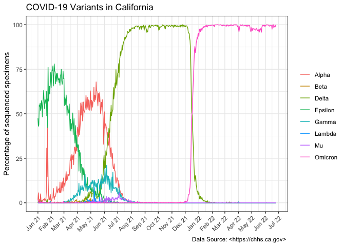

Exam
================
Nattiwong A59004955
7/17/2022

``` r
library(ggplot2)
library(lubridate)
library(dplyr)
```

Download the csv file from the UR

``` r
covid_variant <- read.csv("https://data.chhs.ca.gov/dataset/52e4aa7a-2ea3-4bfd-8cd6-7d653db1ee74/resource/d7f9acfa-b113-4cbc-9abc-91e707efc08a/download/covid19_variants.csv")
```

Make a new column and remove the unwanted data by dplyr/ pipeline,
%&gt;%

``` r
covid_variant <- covid_variant %>%
    mutate(new_date = as.Date(date)) %>% #make a new column with date
    filter(!variant_name %in% c("Other","Total")) #filter out Other and Total in variant_name
```

Draw the graph using ggplot

``` r
ggplot(covid_variant, #specify the dataset
       aes(new_date, percentage,variant_name)) + #plot 3 variables
    geom_line(aes(color=variant_name)) + #variant_name on the legend
    scale_x_date(date_labels = "%b %y", date_breaks = "1 month") + 
    #show the time in month and year format
    theme_bw() + 
    theme(axis.text.x=element_text(angle=45, hjust=1), #rotate axis.text
          axis.title.x = element_blank(), #remove x axis title
          legend.title = element_blank()) + #remove legend title
    labs(y="Percentage of sequenced specimens", 
         title = "COVID-19 Variants in California",
         caption = "Data Source: <https://chhs.ca.gov> ") #add the main title, y-axis and caption
```

<!-- -->
